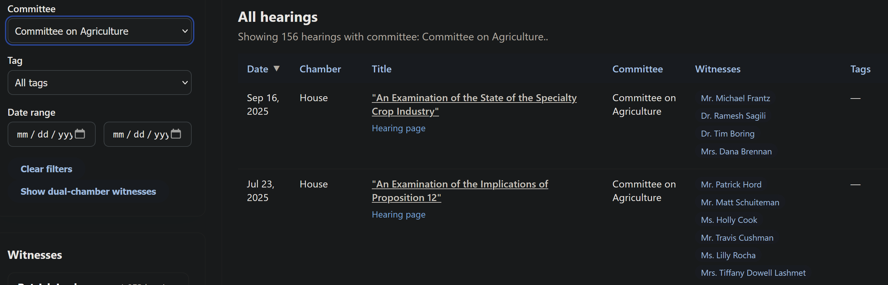

# Witness Witness


###### *A Nick Nick creation*

This is a proof of concept for creating a tracker history of Congressional hearing witnesses. We scrape data from both House and Senate hearings and compile it into a searchable database. The front end is a simple static web page that queries the database and displays results.  Our intent is that this can be used to empower researchers, journalists, and the public to better understand the relationships between who testifies before Congress and the topics they discuss.

The project was created for the [Congressional Hackathon 2025](https://www.house.gov/Hackathon) and everything needed to run it is included in this folder (`witnessWitness/`).

## Run the explorer locally

### Running from Congressional-Hackathon-2025 repo

If running from the root of the `Congressional-Hackathon-2025` repo, follow these steps:

1. From the repository root start a static server. Any option works; for example:
   - Python: `python -m http.server 8000 --directory witnessWitness`
   - uv: `uv run python -m http.server 8000 --directory witnessWitness`
   - npm http-server: `npx http-server witnessWitness` (after `npm init -y` and `npm install --save-dev http-server`)
2. Open your browser to `http://localhost:8000/` (or the port shown in the server output).
3. Interact with `index.html` to explore witnesses, filter hearings, and follow hearing links.

### Running from witnessWitness folder

If running from the `witnessWitness` folder, follow these steps:

1. Start a static server. Any option works; for example:
   - Python: `python -m http.server 8000`
   - uv: `uv run python -m http.server 8000`
   - npm http-server: `npx http-server .` (after `npm init -y` and `npm install --save-dev http-server`)
2. Open your browser to `http://localhost:8000/` (or the port shown in the server output).
3. Interact with `index.html` to explore witnesses, filter hearings, and follow hearing links.

### Using the web app

The web app is a simple static page (`index.html`) that queries the combined SQLite database (`hearings_combined.db`).  It allows you to search for witnesses, filter hearings by date range and keywords, and view details about each hearing.

#### Witness filtering rules

The witness roster intentionally omits a few categories so results focus on expert testimony:

- Anyone tied to more than 55 hearings (usually presiding Senators or Representatives mislabeled as witnesses).
- Entries without a usable first and last name after normalizing titles (`Hon.`, `Dr.`, `USA`, `USAF`, `USN`, etc.), suffixes, trailing location qualifiers such as “of New York”, obvious non-name phrases (“Full hearing transcript is available here”), or party/state annotations like “(R-OK)”.
- Current members of the House or Senate, plus all living former U.S. Senators. These names are stored in `excluded_legislator_keys.json` and matched using normalised keys, including hyphen/apostrophe variants.

To refresh the exclusions, rebuild `excluded_legislator_keys.json` from the latest rosters before serving the UI.

Some example searches to try:

|      |
| :---:|
|  |
| We keep a running list of the top witnesses based on your search criteria.  Above is the top five overall witnesses.  |
|  |
| You can search for specific witnesses by name, or look for committees or topics.  |


## House Database

Scraping the House hearing data proved particularly challenging. The House website does not provide an API or bulk download option for hearing data, so we had to build a custom scraper to extract the information we needed. While the lack of an official API made the task more difficult, the site that hosts the hearing information is relatively well-structured, which made it possible to develop a scraper that could reliably extract the relevant data.

Everything was scraped from the public House website, specifically from pages like [this one](https://docs.house.gov/Committee/Calendar/ByEvent.aspx?EventID=118372). The scraper is designed to extract key details about each hearing, including the title, date, committee, and most importantly, the witnesses who testified.  We figured out the basic structure of the EventID codes, and used that to scan all possible hearing ranges across the different Congressional sessions.  

### Scrape hearing details

The repository includes `code/scrape_hearing.py` for pulling data from a House hearing page.

1. Install dependencies (with uv): `uv pip install -r requirements.txt`
   - Or with pip: `python3 -m pip install --user -r requirements.txt`
2. Run the scraper: `python3 code/scrape_hearing.py`
   - Use `--url` to target a different event, e.g. `python3 code/scrape_hearing.py --url https://docs.house.gov/...`
   - Use `--db` to store results in another SQLite file, e.g. `python3 code/scrape_hearing.py --db my_hearings.db`
   - Crawl a range of event IDs: `python3 code/scrape_hearing.py --start-id 118400 --end-id 118410 --delay 0.2`
      - Add `--checkpoint-dir checkpoints/house` to write `progress.json` (last EventID) and batch JSON dumps every 200 successes (tune with `--batch-size`).
      - Increase concurrency with `--workers 4` (each worker issues requests in parallel while DB writes remain serialized).

Each run writes JSON to stdout and upserts the data into `hearings.db` (tables `hearings` and `witnesses`).
Range crawls emit an array of hearing objects and skip EventIDs that return 404.
Witness entries capture any available Truth in Testimony PDF links (`truth_in_testimony_pdf`).


## Senate Database

The Senate hearing database was more accessable thanks to how accessable the data was due to third party open source resources.  We used the data from [Senate Committee Hearings](https://senatecommitteehearings.com/).  We converted the CSV data to a SQLite database using the provided [CSV to SQLite script](./code/senate_sql_maker.py).

The SQL database 'senate_hearings.sqlite' contains everthing from 'Senate Committee Hearings .csv'.  

Example queries:

Exact name match
```sql
SELECT hearing_title, hearing_date, hearing_tags
FROM witness_hearings
WHERE witness_name = 'Jane Doe'
ORDER BY hearing_date DESC;
```

Case-insensitive partial match
```sql
SELECT witness_name, hearing_title, hearing_date, committee, hearing_tags
FROM witness_hearings
WHERE LOWER(witness_name) LIKE LOWER('%doe%')
ORDER BY hearing_date DESC;
```

All witnesses for hearings with “climate” in the title
```sql
SELECT w.name
FROM hearings h
JOIN hearing_witnesses hw USING(hearing_id)
JOIN witnesses w USING(witness_id)
WHERE LOWER(h.title) LIKE LOWER('%climate%');
```

## Combine Databases

We provide `code/combine_hearings.py` to merge the House and Senate databases into a single SQLite database (`hearings_combined.db`). This is the database used by the front end web page. Run `python3 code/combine_hearings.py` after new scrapes to refresh the combined dataset that backs the UI.
